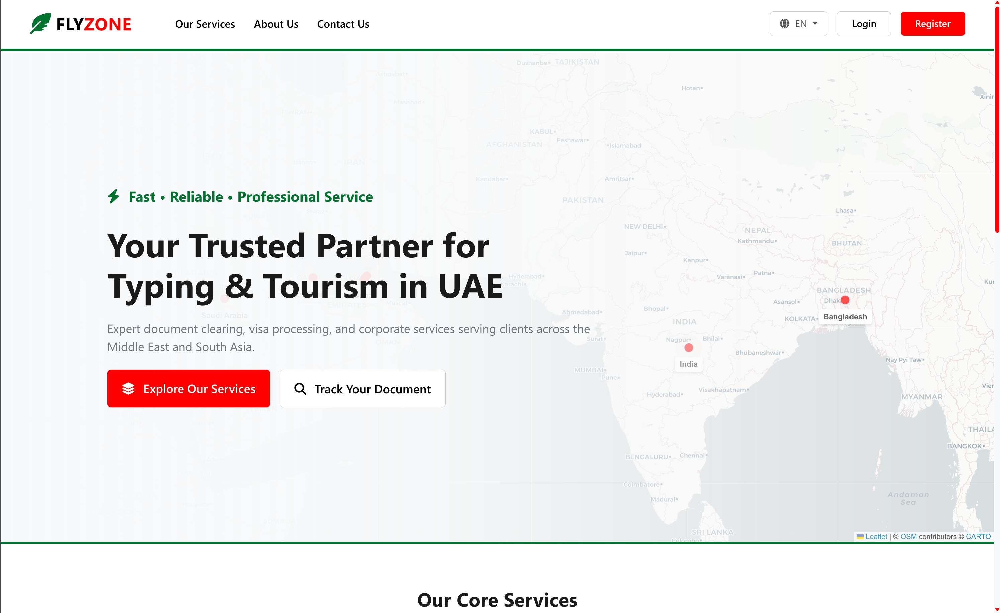
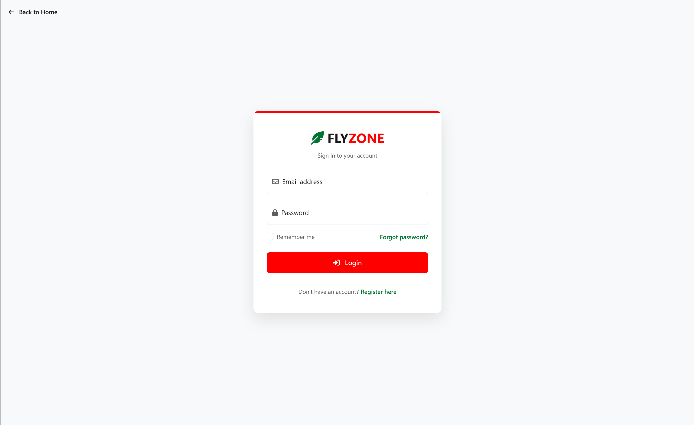
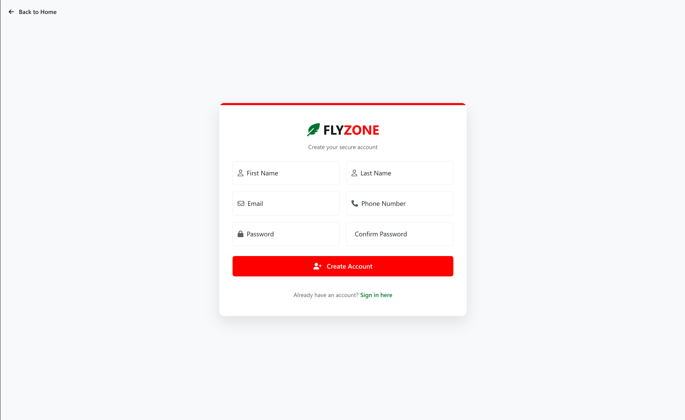
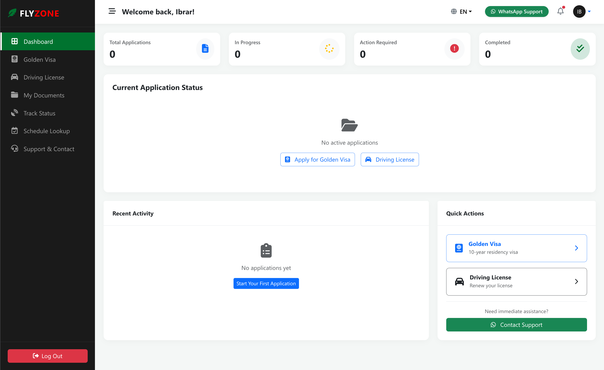
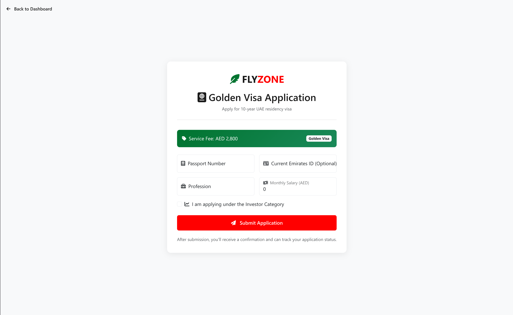
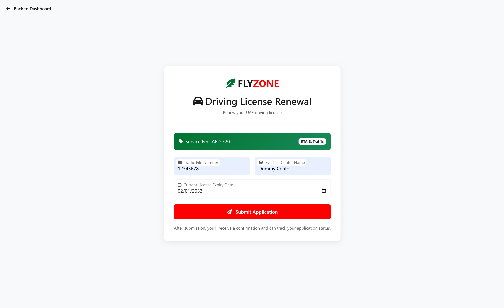

# 🦅 Flyzone Tourism & Typing Services

A modern ASP.NET Core MVC web application for managing tourism services and typing applications in the UAE. Built with security, scalability, and user experience in mind.



---

## ✨ Features

### 🔐 Authentication & Security
- **ASP.NET Core Identity** with strict password policies
- Account lockout after 5 failed attempts (15-minute lockout)
- Rate limiting on login/registration and form submissions
- Secure file uploads with magic byte validation
- Global security headers (CSP, X-Frame-Options, etc.)
- CSRF protection on all POST actions

### 📝 Service Applications
- **Golden Visa Application** - 10-year UAE residency visa processing
- **Driving License Renewal** - UAE driving license renewal service
- Real-time application tracking with status history

### 📊 Dashboard
- Personalized welcome with user's first name
- Application statistics (Total, In Progress, Action Required, Completed)
- Visual progress tracker for active applications
- Recent activity feed with status badges
- Quick action buttons for new applications

### 🐳 Docker Support
- Production-ready Dockerfile with multi-stage build
- SQLite database persistence via Docker volumes
- Uploaded files persistence
- Health checks configured

---

## 🛠️ Technology Stack

| Layer | Technology |
|-------|------------|
| **Framework** | ASP.NET Core 10.0 MVC |
| **Database** | SQLite with EF Core |
| **Authentication** | ASP.NET Core Identity |
| **Frontend** | Bootstrap 5 + Custom CSS |
| **Icons** | Font Awesome 6.4 |
| **Containerization** | Docker & Docker Compose |

---

## 🚀 Getting Started

### Prerequisites
- [.NET 10.0 SDK](https://dotnet.microsoft.com/download/dotnet/10.0)
- [Docker Desktop](https://www.docker.com/products/docker-desktop) (for containerization)

### Local Development

```bash
# Clone the repository
git clone https://github.com/ibraramin/FlyzoneMockup.git
cd FlyzoneMockup

# Restore dependencies
dotnet restore

# Run the application
dotnet run
```

Visit `http://localhost:5000` in your browser.

### Docker Deployment

```bash
# Build and run with Docker Compose
docker-compose up --build

# Or run in detached mode
docker-compose up -d --build
```

The application will be available at `http://localhost:5000`

---

## 📁 Project Structure

```
FlyzoneMockup/
├── Controllers/          # MVC Controllers
│   ├── AccountController.cs
│   └── ServicesController.cs
├── Data/                 # Database Context
├── Models/               # Entity Models
│   ├── ApplicationUser.cs
│   ├── ServiceApplication.cs
│   └── Forms/
├── ViewModels/           # View Models
├── Views/                # Razor Views
│   ├── Account/
│   ├── Services/
│   └── Shared/
├── wwwroot/              # Static Assets
├── imgs/                 # Images
├── Dockerfile            # Docker build configuration
├── docker-compose.yml    # Docker Compose configuration
└── Program.cs            # Application entry point
```

---

## 🔒 Security Configuration

### Password Policy
- Minimum 8 characters
- Require uppercase, lowercase, digit, and special character
- Require 4 unique characters

### Rate Limiting
- **Auth Actions**: 10 requests per minute per IP
- **Form Submissions**: 5 requests per minute per IP

### File Upload Restrictions
- Allowed types: `.pdf`, `.jpg`, `.jpeg`, `.png`
- Maximum size: 5 MB
- MIME type validation via magic bytes
- Files renamed to GUID to prevent guessing

---

## 📸 Screenshots

### Login Page


### Registration Page


### Dashboard


### Golden Visa Form


### Driving License Form


---

## 🤝 Contributing

1. Fork the repository
2. Create your feature branch (`git checkout -b feature/AmazingFeature`)
3. Commit your changes (`git commit -m 'Add some AmazingFeature'`)
4. Push to the branch (`git push origin feature/AmazingFeature`)
5. Open a Pull Request

---

## 📄 License

This project is licensed under the MIT License.

---

## 📧 Contact

For questions or support, reach out to the development team.

---

<p align="center">
  <strong>🦅 Flyzone - Your Gateway to UAE Services</strong>
</p>